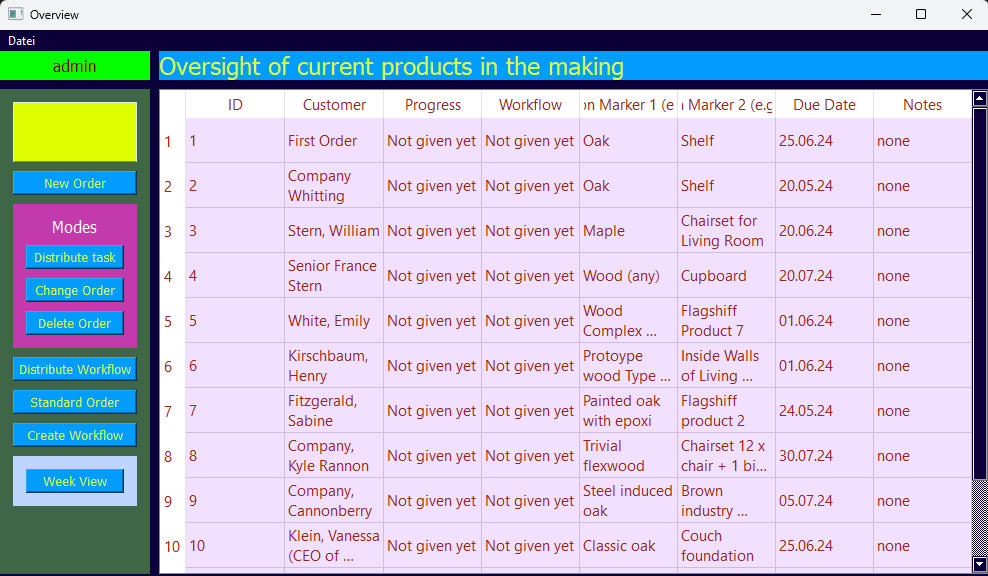
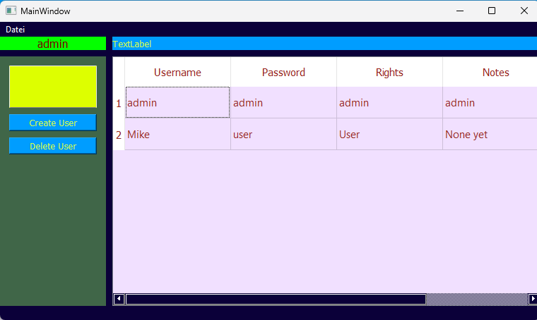

### THIS IS A PRE PROJECT FOR PRACTICE PURPOSES
"you can read the code and feel free to fork it. But it will not be worked on anymore by me.
Instead, I'm going to set this up correctly now, that I've learned so much through this 8000 lines monster. 
It's decently organized. You can browse to learn a little bit more about coding, if you're new. 
If you're a senior in programming, then maybe be Program Design itself, what it does and so on, can be very interesting.

The program design, its purpose is in fact (in my opinion) a really good concept. Mid sized enterprises can only gain from this type of agile 
program. But it has too many flaws at this point and I must say, that I am not currently going to try to make this - still very good - programm into 
a running for production type program. 

Again. I will rewrite this at some point, because it is really well thought through, but organically grew. therefore it is too big to ad just new stuff. 
It needs to be built up differently. I am rewriting this as a web application at some point. I will link this here at that point in time."

Currently at 85% of V1.0

This application does still need some hours of work. Beware!

First video about the UI and it's usage is ready in explain_vid_pre_v1.0.mp4 

This is a software that is freely usable for anyone; Any usage is at the users own risk. No guarantees.

### What's this?
* A tool for a company of mid size, that produces products of any kind, that makes efficiency tracking automated.
  * The Operations or Production Team leader can simply assign the tasks, that come with products.
  * Has an Overview of all the currently ordered products
  * 
  * Admin has special rights
    * User creation and deletion
    * 
  * Operator has special rights
  * Login with database handling of users
  * Create and distribute workflows to products
  * User/production worker has different rights and different view:
    * Only sees his tasks on a day, but can look into the future days and past days for his planning
* It's name is operator production process, or short: opp

What is V1.0 going to have?
V1.0 OPP is going to have a fully functioning work schedule with replanning.

What's the idea about this software?
* Efficiency controlling of companies with difficult structures
  * Carpenters, any electronic devices production, trucking companies
* Errors are more visible and traceable 

Idea for the future:
* The database hold all the info, that in V2.0 there could be an analytics tool besides this.
  * This analytics tool shows how much time each products costs and how long the individual steps take
  * There can be an AI controlling tool for the time recording of the tasks to improve production

